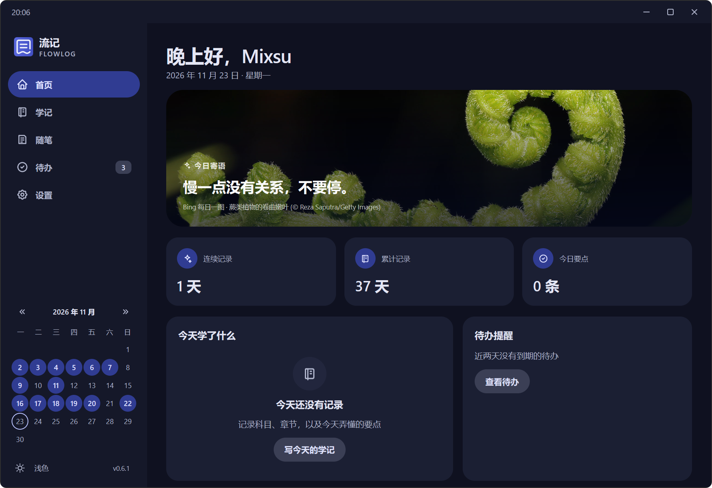
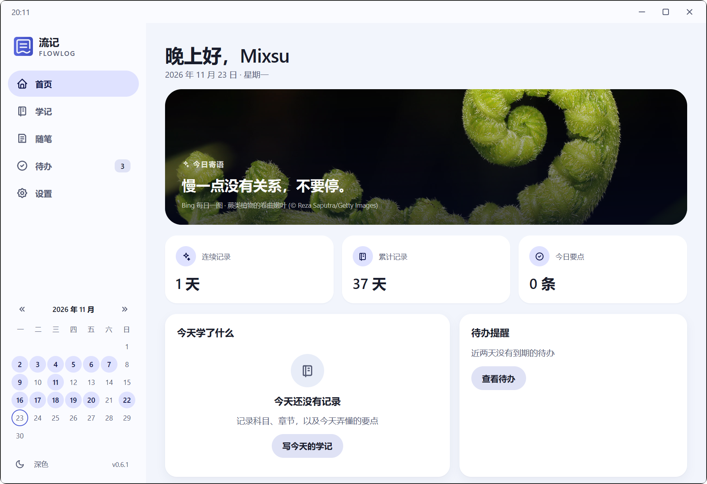
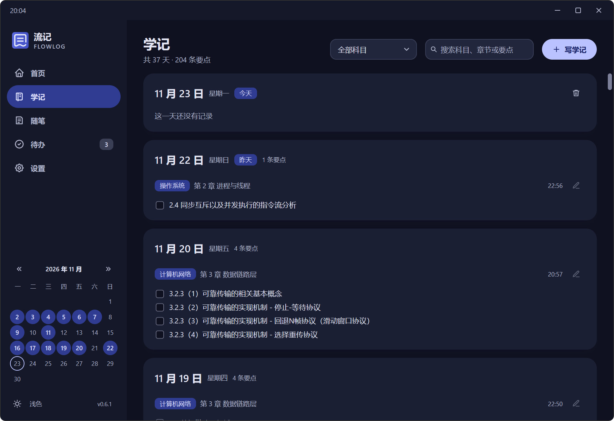
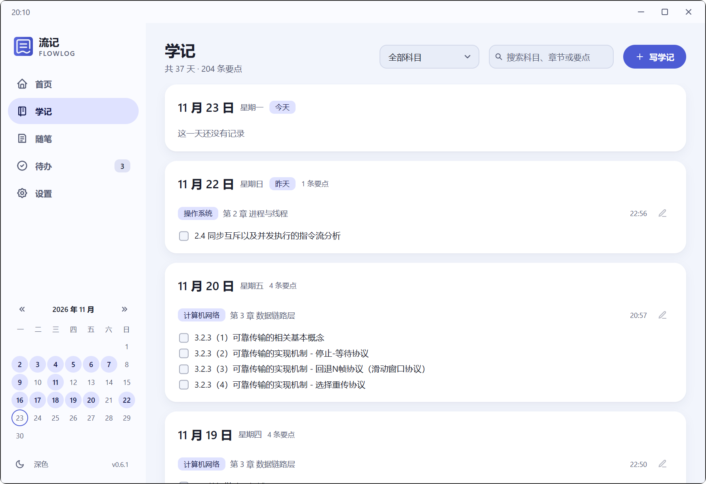
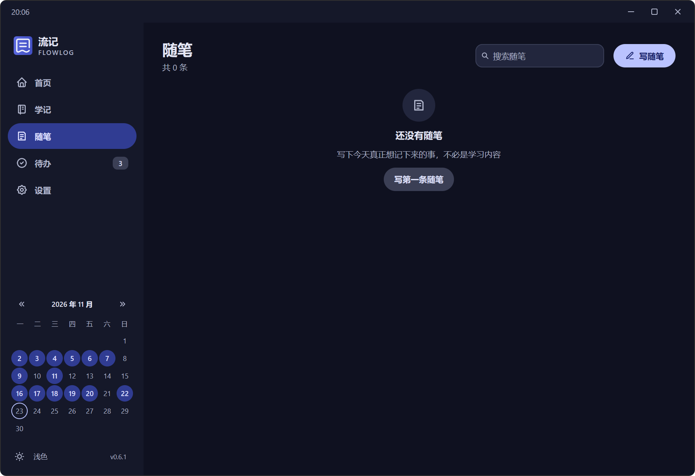
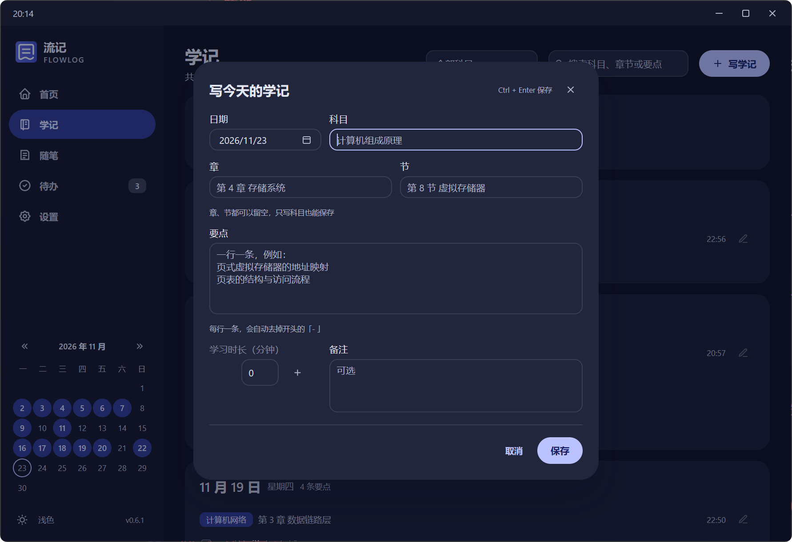
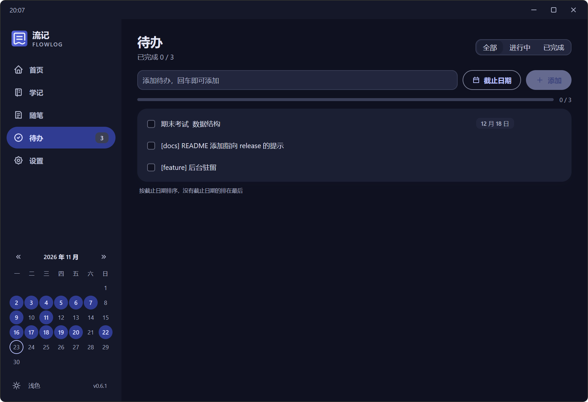
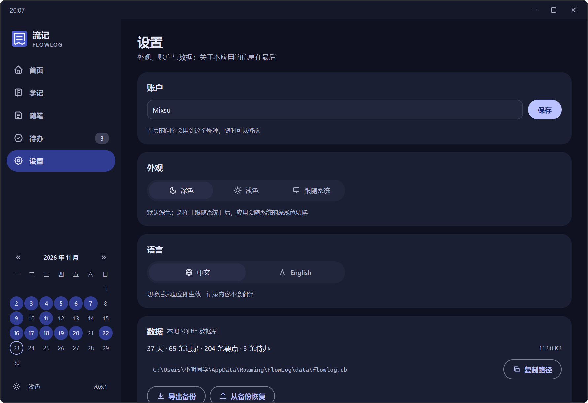

<p align="center">
  
</p>

<h1 align="center">流记 · FlowLog</h1>

<p align="center">⌈ 把每天的学习和思考，都记录成一条清晰的流 ⌋</p>

<p align="center">一个记录每日学习情况的桌面应用：按科目、章节与要点组织学记，以及简单记录随笔和待办</p>

<p align="center">
  <a href="README.md">简体中文</a> ·
  <a href="README.en.md">English</a>
</p>

<p align="center">
  
  
  
</p>

<p align="center">目前仍处于 alpha 开发状态，可能会进行破坏性更新导致数据丢失</p>

---

<p align="center">开发者只是个大学生，该项目仅作为本地小工具使用，如有不满，还请见谅</p>

<p align="center">使用 DeepSeek Harness 配合 DeepSeek V4.1 Flash 模型开发</p>

<p align="center">
  <a href="https://awesomemygo.dev/apps/flowlog">
    
  </a>
</p>

<p align="center">
  
  
  
  
  
</p>

流记使用 [MyGo](https://mygo.run) 的原生 UI 模式编写：界面由 Go 代码描述，由 MyGo 在 GPU 上绘制，不加载 WebView 。

UI 界面采用类 Material Design 3 风格：主色、容器层级、圆角与动效都按 MD3 的角色划分。

## ◈ 功能

| 模块   | 说明                                                                                                                         |
| ------ | ---------------------------------------------------------------------------------------------------------------------------- |
| 首页   | 每日寄语（背景为必应每日一图）、连续记录天数、今日要点、待办提醒（今天与明天到期）                                           |
| 学记   | 按日期倒序的记录卡片；一条记录包含科目、章、节、若干要点与备注，可标记要点为已复习；支持按科目筛选与全文搜索，命中的字带高亮 |
| 随笔   | 按日期倒序的一列随笔，记录每天真正想写下的东西；支持搜索、编辑与删除，和学记互不影响                                         |
| 待办   | 全部待办列表；可为每条设置截止日期，按截止日期排序；支持勾选、复制、删除（可撤销）、按状态筛选                               |
| 侧边栏 | 今天记录了多少条、还有多少待办；月历中标出有记录的日子，点一天直接跳到那一天的学记                                           |
| 设置   | 称呼、明暗模式、界面语言（中文 / English）、数据备份与恢复、自动备份、快捷键、关于与版本更新                                 |
| 窗口   | 自绘标题栏：左侧当前时间，右上角最小化 / 最大化 / 关闭；整条可拖动，双击最大化                                               |

## ◈ 截图

| 首页 · 深色（默认）                    | 首页 · 浅色                                 |
| -------------------------------------- | ------------------------------------------- |
|  |  |

| 学记                                    | 学记 · 浅色                                  |
| --------------------------------------- | -------------------------------------------- |
|  |  |

| 随笔                                      | 写学记                                          |
| ----------------------------------------- | ----------------------------------------------- |
|  |  |

| 待办                                   | 设置                                       |
| -------------------------------------- | ------------------------------------------ |
|  |  |

## ◈ 环境要求

- Go 1.27 或更高版本
- MyGo CLI：项目已在 `go.mod` 中以 `tool` 依赖固定版本，直接用 `go tool mygo` 调用，无需单独安装
- 构建安装包时需要 NSIS（Windows 安装器）等平台工具，详见 [MyGo 分发文档](https://mygo.run/docs/distribution)

## ◈ 开发

```bash
go tool mygo dev      # 编译、启动应用，并在 Go 代码改动后自动重启
go test ./...         # 单元测试与界面交互测试
go vet ./...          # 静态检查
gofmt -l .            # 检查格式
```

界面预览会在测试中渲染成 PNG（浅色、深色、筛选、弹窗都有一张）：

```bash
go test ./internal/view -run TestPreview -v
```

## ◈ 构建

```bash
go tool mygo build                 # 当前平台
go tool mygo build -platform windows/amd64,darwin/arm64
```

产物位于 `build/`。Windows 生成安装包，macOS 生成 `.app` 与 `.dmg`，Linux 生成 `.tar.gz` 与安装脚本。

## ◈ 数据

数据库文件为 `data/flowlog.db`（SQLite）。位置随运行方式变化：

| 运行方式                        | 数据目录                                                                                                             |
| ------------------------------- | -------------------------------------------------------------------------------------------------------------------- |
| `go tool mygo dev` / `go run .` | 项目下的 `./data`                                                                                                    |
| 安装后的应用                    | Windows `%APPDATA%\FlowLog\data`，macOS `~/Library/Application Support/FlowLog/data`，Linux `~/.config/FlowLog/data` |
| 设置了 `FLOWLOG_DATA`           | 使用该目录（便于放到同步盘）                                                                                         |

表结构：

| 表         | 内容                                           |
| ---------- | ---------------------------------------------- |
| `days`     | 有学记的日期                                   |
| `entries`  | 学习记录，属于某一天                           |
| `points`   | 要点，属于某条记录                             |
| `todos`    | 待办：内容、完成状态、创建日期、可选的截止日期 |
| `settings` | 键值设置（外观、称呼、自动备份）               |

学记的写入以事务为单位：一次保存要么全部成功，要么全部回滚。待办逐条读写。

旧版本（0.3 及更早）的数据库会在启动时自动升级，已有数据保留。

**备份与迁移**

- **自动备份**：每天首次启动时把全部数据写到 `backups/flowlog-auto-<日期>-<时间>.json`，默认保留最近 14 份；可以在设置里关掉、调整份数或立即备份。
- **导出备份**：生成一个 JSON 文件，包含全部学记、待办与设置。
- **从备份恢复**：选择备份文件，覆盖当前全部数据（会二次确认）；覆盖之前会先自动存一份 `flowlog-before-restore-*.json`，恢复错了还能找回。

## ◈ 自动更新

应用使用 MyGo 的更新机制：更新包由 Ed25519 私钥签名，应用内置对应公钥，启动后自动检查、下载、校验并替换文件，随后重启生效。

### 发布流程

1. 修改 `mygo.json` 中的 `version`，在 `CHANGELOG.md` 中补一节 `## <版本号>`。
2. 提交并打标签：`git tag v0.x.x && git push origin v0.x.x`。
3. GitHub Actions 读取该版本的 CHANGELOG 作为发布说明，创建草稿 Release，并在三个平台并行构建、上传产物。
4. 全部成功后自动发布；已安装的应用会在下次检查时看到新版本。

工作流见 [.github/workflows/release.yml](.github/workflows/release.yml)。

### 一次性配置

在仓库的 **Settings → Secrets and variables → Actions** 中添加：

| Secret                     | 内容                             |
| -------------------------- | -------------------------------- |
| `MYGO_UPDATER_PRIVATE_KEY` | `mygo-update.key` 文件的完整内容 |

私钥由 `go tool mygo keygen` 生成，默认位于用户配置目录的 `mygo/update-keys/` 下。

私钥丢失将无法再向已安装的用户推送更新，请妥善备份。

可选（正式签名，避免 macOS Gatekeeper 与 Windows SmartScreen 拦截）：详见 [MyGo 应用签名](https://mygo.run/zh/docs/github-actions)

### 更新如何生效

- 已安装的应用每 24 小时检查一次，也可在设置页手动检查。
- 发现新版本后可在设置页直接下载安装，安装完成后应用自动重启。
- 只有用同一私钥签名的更新才会被接受。
- 开发构建（`mygo dev`、`go run`）与包管理器安装的版本不参与自动更新；用户也可以从 Releases 手动下载新版本。

## ◈ 项目结构

```text
main.go                  启动、窗口、数据库打开与关闭、发布说明
internal/model/          数据结构（Day / Entry / Point / Todo / Settings）
internal/store/          SQLite 读写、schema 升级、备份导出与恢复
internal/design/         设计系统：MD3 色板、字号、圆角、动效、图标、基础组件
internal/app/            应用状态与动作：学记、待办、设置、备份、更新、背景图
internal/pages/          五个页面：首页、学记（含筛选与编辑弹窗）、随笔、待办、设置
internal/view/           窗口外壳：根视图、侧边栏、月历、全局弹层、快捷键
resources/               应用图标（同时嵌入程序）
docs/                    开发手记与界面截图
.github/workflows/       三平台发布工作流
```

依赖方向是单向的：`design ← app ← pages ← view ← main`。

页面只读状态、调动作；状态层不画界面；设计系统不认识业务。

`docs`文件夹中，`showPNG` 文件夹用来在 README 中展示截图，`screenshots` 文件夹用来生成界面测试截图

## ◈ 已知限制

- 自动更新依赖 GitHub Releases，需要仓库公开或使用可访问的 HTTPS 地址。
- 目前仅支持单窗口、本地单用户数据。

## ◈ 许可

[MIT](LICENSE)
